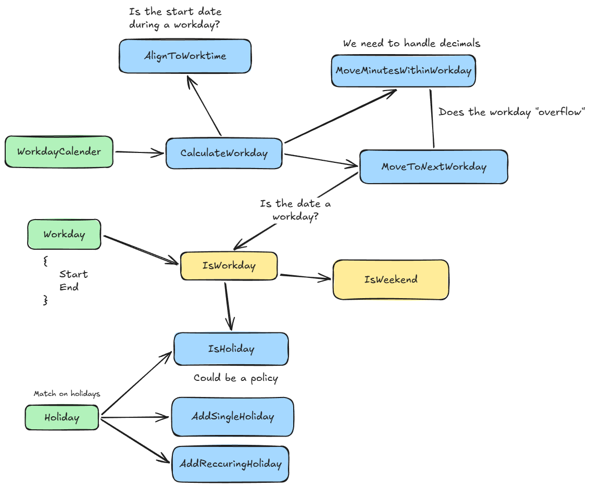

# Coding Case - Workday Calendar

This repository contains the solution for the provided Workday Calendar Case.

The project implements a calendar system that returns the dates while adjusting to:

- Working hours
- Weekends and holidays
- Forward and backwards shifting of workdays

## Core idea

Handle the workday as a unit of time, not as a typical calendar day. Calculations should only happen during the given timeframe, i.e., when the workday is. Holidays, weekends, and before/after the workday should be skipped.

### Design decisions

1. _Workday as a time unit_
   Instead of using a typical day (24h), the workday is considered as its own unit. This makes it easier to shift, seeing it as "are we outside of the time unit should we shift to the next one" based on the logic.

2. _Structure_
   The project is divided into different parts based on its domain (core models), policy (validation and rules) or service (logic and calculations). This desicion was made to ensure it follows a clean architecture (even if its a small project).

3. _Approach to calculation of workday_
   When shifting workday, the logic is divided into two steps. First, we align to worktime, making it possible to start calculating from a "non-workday time". Secondly, shifting is handled as workdays and minutes, see the next point.

4. _Handling fractions of a workday_
   Decimal values are handled separately from whole values. I.e. 2.5 is calculated as 2 whole workdays and 0.5 workday.
   The decimal value is calculated as minutes of a workday, while the whole value is handled as a whole shift.

5. _Diagram of solution_
   

## Tests

The solution includes tests written based on the examples provided, as well as some miscellaneous tests written during the development phase. This case was solved with a test-driven approach.

Tests include:

- Forward and backwards shifting of workday regardless of starting time
- Adding and taking holidays into account
- Check for the weekend
- Workday start/end

## Tradeoffs

At first, I thought of creating a custom date type, similar to DateTime, that would be specialized for the calculations that Workday could need. The main win from this, from my perspective, would be to set workday boundaries and handle movement of the workweek within this type.

However this was discarded since it would increase the complexity of this case, but for a more complex case, it could be a solution.

## Future improvements

- Handle multiple work intervals and breaks
- Configure "weekends" to match different workweeks (i.e., Monday-Tuesday could be weekends)
- Holidays not set to a date but rather based on day of the week (i.e., first Monday in May)
